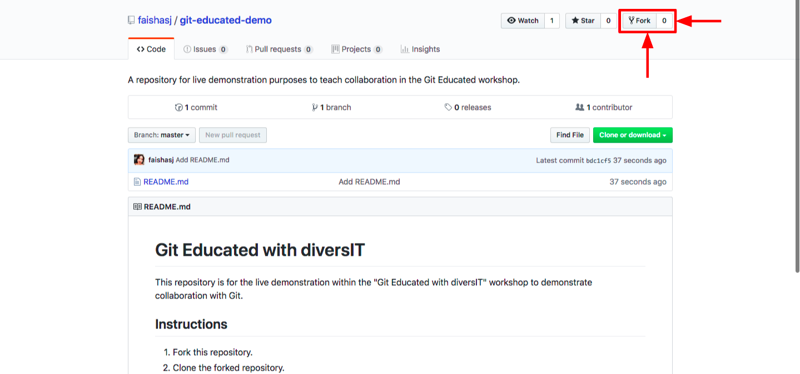
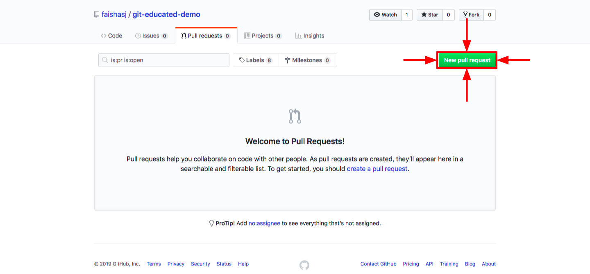

# Git Educated with diversIT

This repository is for the live demonstration within the "Git Educated with diversIT" workshop to demonstrate collaboration with Git.

## Instructions

Fork this repository.



Clone the forked repository.
```bash
$ git clone https://github.com/<username>/git-educated-demo.git
```

Add an upstream remote.

```bash
$ git remote add upstream https://github.com/faishasj/git-educated-demo.git
```

Fetch changes from the upstream.

```bash
$ git fetch upstream <branch>
```

Create and checkout a new branch.

```bash
$ git checkout -b <branch>
```

Add your name under the correct date in attendees.

Commit and push changes to the origin remote.

```bash
$ git commit -m “<message>”
$ git push origin <branch>

```

Submit a pull request.



## Attendees

#### Wednesday, 3rd April 2019